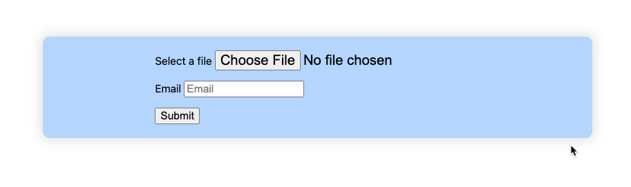
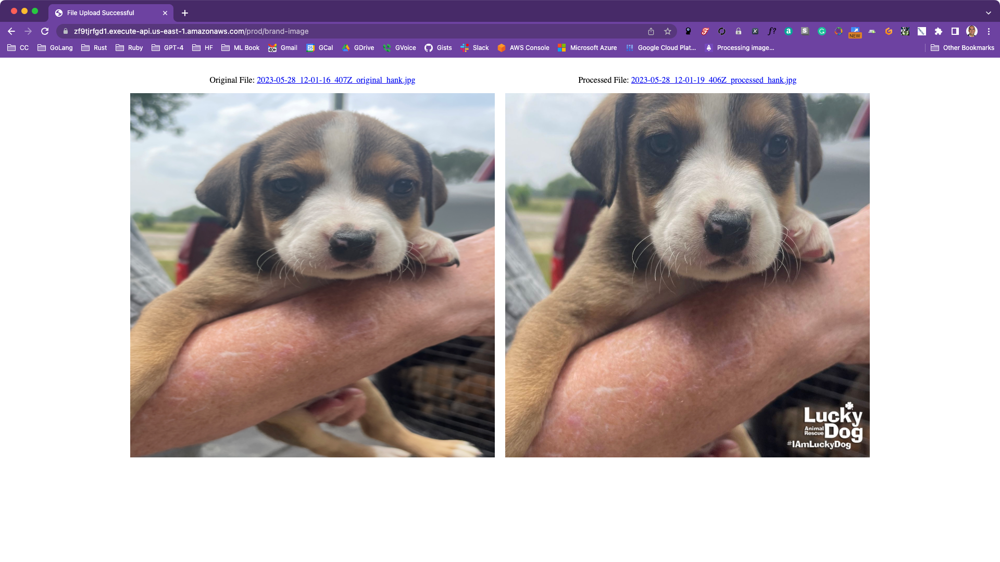

P6 LDAR Chrome Pet Image Brander

# P6 LDAR Chrome Pet Image Brander

## LICENSE

## Usage

Upload a jpeg, png, or gif. Receive a sized and branded one back.

## TODO

- Allow a zip file of images
- Dark/Light detection for watermark selection
- Use LDAR site layout

## Author

Philip M. Gollucci <pgollucci@p6m7g8.com>
